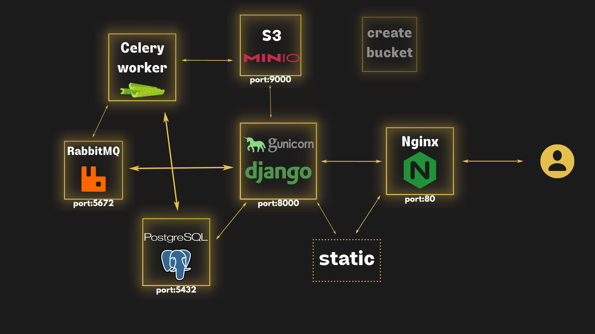

# Django, Celery and MinIO on Docker Compose

Deploy Django and Celery with Docker Compose using a MinIO S3 bucket for media files.

## Desired state

<p align="center">
  
</p>

## How to spin up

* update the environment variables in `.env`

* spin up the services

```
docker-compose up
```

* Tear Down

```
docker-compose down
docker volume prune
```